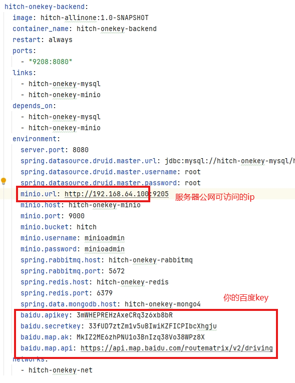
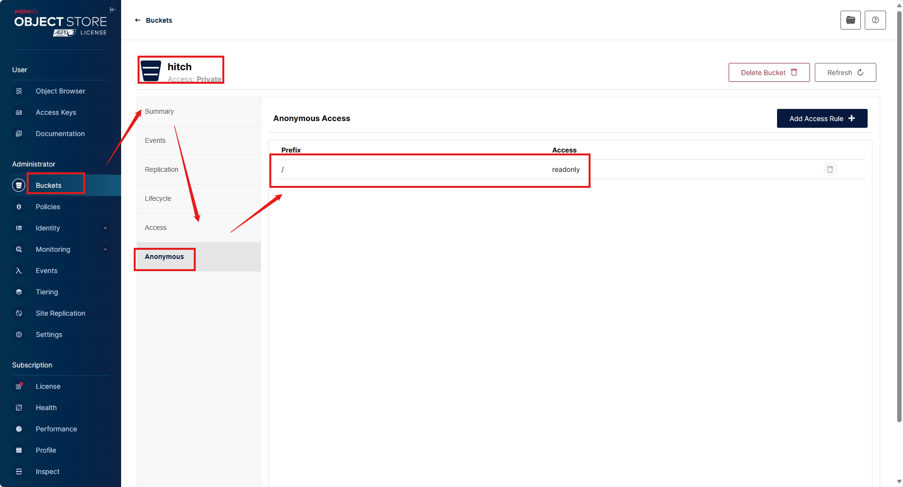
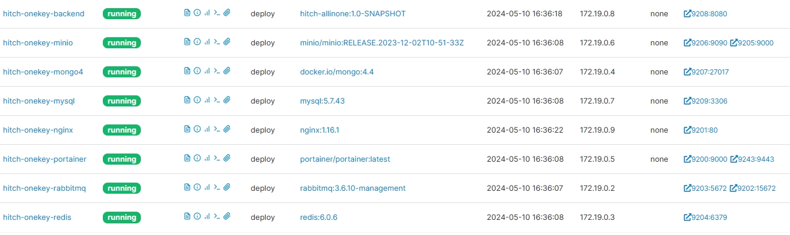

# 1、本地Allinone启动

本地allinone下集成了所有的后台接口及静态页面

用于本地启动和调试，直接main方法启动

访问对应端口即可

# 2、服务器一键部署与启动

## 1、把代码上传到一台服务器

确保服务器安装了maven 、docker 、docker-compose

修改deploy下的docker-compose.yml里的配置，主要涉及以下几个：（其他不必动）

## 2、到  allinone 下执行

mvn package docker:build

## 3、到deploy下执行

docker-compose up -d

## 启动后的一些配置：

各服务端口号：

